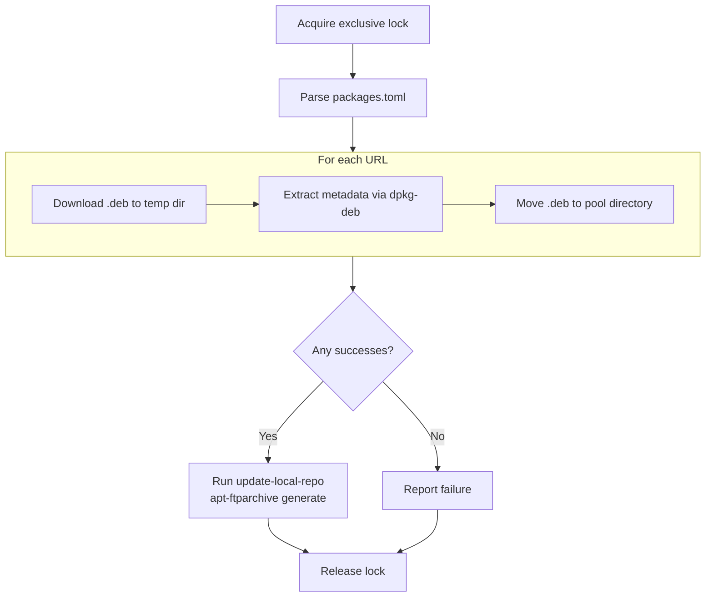

# Architecture

This document describes the architecture of **local-apt** for contributors.

## Purpose

local-apt creates and manages a local APT repository from HTTP download URLs. Users configure `.deb` download URLs in a TOML config file; the `local-apt update` command downloads each package, validates it, places it in an APT repository on the local filesystem, and regenerates metadata so that `apt-get` and `unattended-upgrade` can consume the packages normally.

## High-Level Flow



## Repository layout

The repository is both a native Debian package and Rust package.

```
.
├── build.sh                      # Builds the .deb via Docker
├── Cargo.toml                    # Rust project manifest
├── Dockerfile                    # Multi-stage build: compile + package
├── src/                          # Rust source (the local-apt binary)
├── install/                      # Static files installed by the .deb package
│   ├── packages.toml             # Default config file: /etc/local-apt/packages.toml
│   ├── local.sources             # APT sources entry: /etc/apt/sources.list.d/
│   ├── apt-ftparchive-conf/      # Configuration files for apt-ftparchive
│   └── man/                      # Manual pages
|
└── debian/                       # Debian packaging metadata
```

## Variable data

The `local-apt` command maintains variable data in the installed filesystem.

### APT repo

The APT repo is stored in `/var/lib/local-apt/` and follows standard a APT repository structure. One suite (`stable`) is available with one component (`main`).

- `/var/lib/local-apt/pool/main/`: downloaded `.deb` files in directories based on the package name
- `/var/lib/local-apt/dists/stable/main/`: the `main` component of the `stable` suite. See `sources.list(5)`.

### Lock file

- `/var/lock/local-apt.lock`: locked when `local-apt` runs to ensure only one process modifies `/var/lib/local-apt/`.
